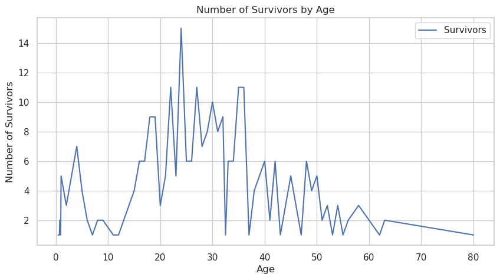
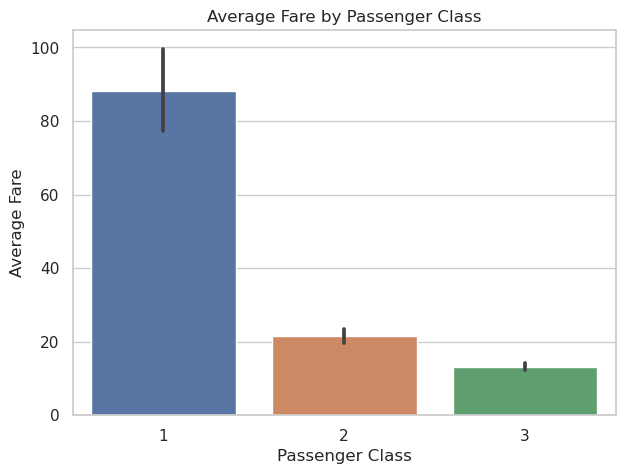
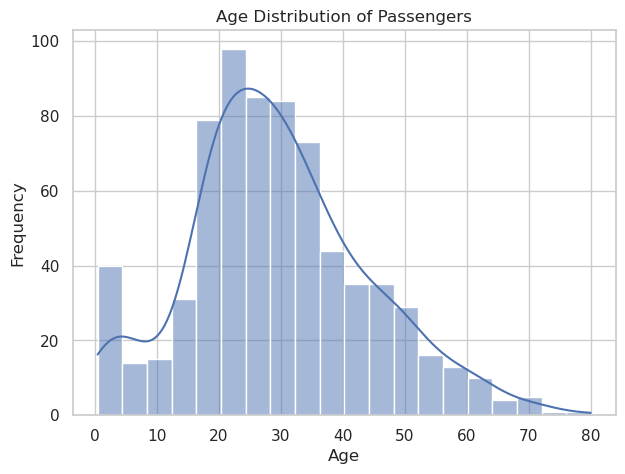
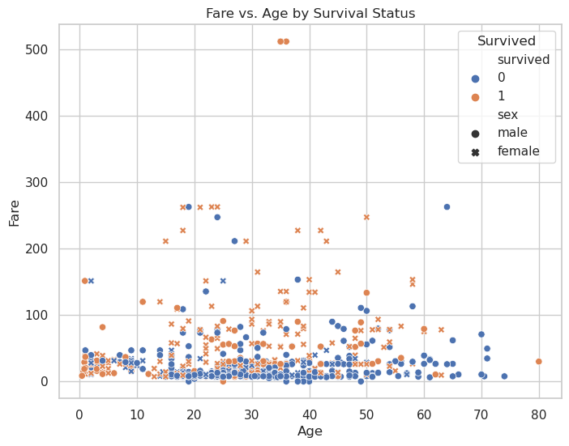

```python
# Import libraries
import pandas as pd
import matplotlib.pyplot as plt
import seaborn as sns

# Plot style
sns.set(style="whitegrid")

# Task 1: Load and Explore the Dataset
try:
    # Load Titanic dataset from seaborn
    df = sns.load_dataset("titanic")
    
    print("First 5 rows of the dataset:")
    print(df.head())

    print("\nData types and missing values:")
    print(df.info())

    print("\nMissing values:")
    print(df.isnull().sum())

    # Clean dataset: drop rows with missing age or embarked
    df = df.dropna(subset=['age', 'embarked'])
    df['embarked'] = df['embarked'].fillna('S')
except Exception as e:
    print(f"Error loading dataset: {e}")

# Task 2: Basic Data Analysis
print("\nSummary statistics:")
print(df.describe())

# Group by class and compute average fare and age
grouped_stats = df.groupby('pclass')[['fare', 'age']].mean()
print("\nAverage fare and age by class:")
print(grouped_stats)

# Observation
print("\nObservation:")
print("1st class passengers paid the highest fare and were older on average.")

# Task 3: Data Visualization

# 1. Line chart: number of survivors over age (trend)
plt.figure(figsize=(10, 5))
survivors_by_age = df[df['survived'] == 1].groupby('age').size()
plt.plot(survivors_by_age.index, survivors_by_age.values, label='Survivors')
plt.title("Number of Survivors by Age")
plt.xlabel("Age")
plt.ylabel("Number of Survivors")
plt.legend()
plt.grid(True)
plt.show()

# 2. Bar chart: average fare by passenger class
plt.figure(figsize=(7, 5))
sns.barplot(data=df, x='pclass', y='fare', estimator='mean')
plt.title("Average Fare by Passenger Class")
plt.xlabel("Passenger Class")
plt.ylabel("Average Fare")
plt.show()

# 3. Histogram: distribution of passenger ages
plt.figure(figsize=(7, 5))
sns.histplot(df['age'], bins=20, kde=True)
plt.title("Age Distribution of Passengers")
plt.xlabel("Age")
plt.ylabel("Frequency")
plt.show()

# 4. Scatter plot: Fare vs. Age by Survival
plt.figure(figsize=(8, 6))
sns.scatterplot(data=df, x='age', y='fare', hue='survived', style='sex')
plt.title("Fare vs. Age by Survival Status")
plt.xlabel("Age")
plt.ylabel("Fare")
plt.legend(title="Survived")
plt.show()

```

    First 5 rows of the dataset:
       survived  pclass     sex   age  sibsp  parch     fare embarked  class  \
    0         0       3    male  22.0      1      0   7.2500        S  Third   
    1         1       1  female  38.0      1      0  71.2833        C  First   
    2         1       3  female  26.0      0      0   7.9250        S  Third   
    3         1       1  female  35.0      1      0  53.1000        S  First   
    4         0       3    male  35.0      0      0   8.0500        S  Third   
    
         who  adult_male deck  embark_town alive  alone  
    0    man        True  NaN  Southampton    no  False  
    1  woman       False    C    Cherbourg   yes  False  
    2  woman       False  NaN  Southampton   yes   True  
    3  woman       False    C  Southampton   yes  False  
    4    man        True  NaN  Southampton    no   True  
    
    Data types and missing values:
    <class 'pandas.core.frame.DataFrame'>
    RangeIndex: 891 entries, 0 to 890
    Data columns (total 15 columns):
     #   Column       Non-Null Count  Dtype   
    ---  ------       --------------  -----   
     0   survived     891 non-null    int64   
     1   pclass       891 non-null    int64   
     2   sex          891 non-null    object  
     3   age          714 non-null    float64 
     4   sibsp        891 non-null    int64   
     5   parch        891 non-null    int64   
     6   fare         891 non-null    float64 
     7   embarked     889 non-null    object  
     8   class        891 non-null    category
     9   who          891 non-null    object  
     10  adult_male   891 non-null    bool    
     11  deck         203 non-null    category
     12  embark_town  889 non-null    object  
     13  alive        891 non-null    object  
     14  alone        891 non-null    bool    
    dtypes: bool(2), category(2), float64(2), int64(4), object(5)
    memory usage: 80.7+ KB
    None
    
    Missing values:
    survived         0
    pclass           0
    sex              0
    age            177
    sibsp            0
    parch            0
    fare             0
    embarked         2
    class            0
    who              0
    adult_male       0
    deck           688
    embark_town      2
    alive            0
    alone            0
    dtype: int64
    
    Summary statistics:
             survived      pclass         age       sibsp       parch        fare
    count  712.000000  712.000000  712.000000  712.000000  712.000000  712.000000
    mean     0.404494    2.240169   29.642093    0.514045    0.432584   34.567251
    std      0.491139    0.836854   14.492933    0.930692    0.854181   52.938648
    min      0.000000    1.000000    0.420000    0.000000    0.000000    0.000000
    25%      0.000000    1.000000   20.000000    0.000000    0.000000    8.050000
    50%      0.000000    2.000000   28.000000    0.000000    0.000000   15.645850
    75%      1.000000    3.000000   38.000000    1.000000    1.000000   33.000000
    max      1.000000    3.000000   80.000000    5.000000    6.000000  512.329200
    
    Average fare and age by class:
                 fare        age
    pclass                      
    1       88.048121  38.105543
    2       21.471556  29.877630
    3       13.229435  25.140620
    
    Observation:
    1st class passengers paid the highest fare and were older on average.


    

    


    

    


    

    


    

    


```python

```
